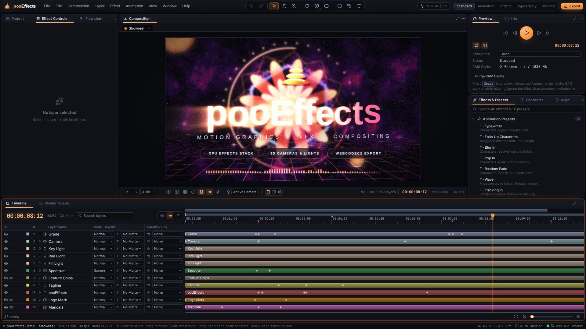

# pooEffects

**A motion-graphics, VFX and compositing workstation that runs entirely in the browser.**



pooEffects is a client-side take on the After Effects workflow: a frame-accurate timeline with value and speed graphs,
3D cameras and lights with depth of field, procedural shape layers, kinetic typography, a WebGL2 effects stack,
RAM preview, and WebCodecs export. Nothing is uploaded. Rendering, decoding and encoding all happen on your machine,
mostly inside a Web Worker on the GPU.

On first launch it opens a built-in 12-second **demo title sequence**: a 3D camera on a spatial Bézier path with a rack
focus, a mandala built from shape operators, a soft-serve logo made of Bézier paths, staggered kinetic type, a scrolling
synthwave floor, a fractal-noise nebula, and a procedurally synthesised soundtrack driving an Audio Spectrum. Press
<kbd>Space</kbd> to play it.

It also ships a **Tracking Demo** comp for trying the **computer-vision tools**. It holds a synthetic handheld plate (a
trucking 3D camera with shake, an angled billboard, pillars at several depths and a textured floor), plus an *Insert
Card* precomp ready to be corner-pinned onto the billboard. The tools are:
- the point tracker and stabilizer;
- the planar corner-pin tracker;
- the 3D camera solver;
- **SAM 2 Roto Brush**: AI segmentation running in WebGPU, inside your browser.

---

## Quick start

Requirements: **Node.js 20+** and a desktop browser with **WebGL2**. Chrome or Edge 113+ is recommended
(OffscreenCanvas-in-worker rendering and full WebCodecs export).

```bash
npm install
npm run dev        # http://localhost:5173
```

| Command             | What it does                                                      |
| ------------------- | ----------------------------------------------------------------- |
| `npm run dev`       | Vite dev server with hot module reload                            |
| `npm run build`     | Type-checks the project (`tsc -b`) and builds `dist/`             |
| `npm run preview`   | Serves the production build locally                               |
| `npm run typecheck` | Strict TypeScript check only                                      |
| `npm test`          | Unit tests: interpolation, timecode, expressions, shapes and the computer-vision solvers |

The production build is a static site: deploy `dist/` to any static host. No server code is involved.

### Browser support

| Capability | Used for | Fallback |
| --- | --- | --- |
| WebGL2 + `EXT_color_buffer_float` | GPU compositing, 16-bit float accumulation for motion blur | 8-bit targets |
| OffscreenCanvas in a Worker | Rendering off the UI thread | Inline renderer on the main thread (loaded on demand) |
| WebCodecs `VideoEncoder` / `AudioEncoder` | MP4 / WebM export | GIF and PNG-sequence export still work |
| WebCodecs `VideoDecoder` (via mediabunny) | Frame-accurate video decode | `<video>` element seeking on the main thread |
| Web Audio | Playback, scrubbing, mixdown for export | Silent playback |
| WebGPU | SAM 2 inference (onnxruntime-web) | WASM SIMD backend (correct, much slower) |

For MP4, the exporter picks the first encodable codec in the order H.264, HEVC, AV1, VP9. For audio it tries AAC, then
Opus, then MP3. Builds without proprietary codecs, such as Chromium, therefore produce AV1 + Opus MP4s.

---

## Features

### Timeline & animation
- **Frame-accurate time:** NTSC rates are handled as exact rationals (23.976 → 24000/1001). SMPTE drop-frame timecode
  works at 29.97 and 59.94. Time fields accept timecode, frames (`f120`), seconds (`1.5s`) and relative offsets (`+10`).
- **Keyframes on every property**, with linear, Bézier, continuous, auto-Bézier and hold interpolation.
- **Temporal easing:** each keyframe side has a speed and an influence, exactly as in AE.
  - Easy Ease, Ease In and Ease Out (<kbd>F9</kbd>).
  - A Keyframe Velocity dialog.
  - Roving keyframes.
- **Spatial interpolation:** position-like properties move along an N-D Bézier path with editable tangents, shown as a
  motion path in the viewer. Easing drives distance along the path through an arc-length table, so speed is constant
  per segment.
- **Graph Editor** with value and speed graphs: drag keyframes and ease handles, marquee-select, and convert keyframes to
  hold, linear or auto.
- **Layer timing:** time remapping, time stretch (including negative stretch, which reverses the layer), freeze frame,
  split layer, and in/out point trimming.
- **Work area** and comp markers, plus a **J/K** jump to the previous or next keyframe, marker or edit.
- **Expressions** in JavaScript with AE semantics: the last statement is the value, and the AE vocabulary is in scope:
  - generators: `wiggle`, `noise`, `random`, `gaussRandom`, `seedRandom`;
  - looping: `loopIn`, `loopOut` (`cycle`, `pingpong`, `offset`, `continue`);
  - interpolation: `linear`, `ease`, `easeIn`, `easeOut`;
  - time sampling: `valueAtTime`, `velocity`, `speed`, `posterizeTime`;
  - vector maths: `length`, `normalize`, `dot`, `cross`, `clamp`;
  - colour conversion: `rgbToHsl`, `hslToRgb`;
  - references: `thisComp.layer("…").transform.position`, `effect("…")("…")`, `key(n)`, `nearestKey()`,
    `toComp()` / `fromComp()`.

  Errors are reported per property.

### Layers & 3D
- **Layer types:**
  - solids, adjustment layers and nulls;
  - shapes and text;
  - images, video and audio;
  - precompositions;
  - cameras;
  - lights: point, spot, parallel and ambient.
- **Parenting with a pick whip.** Parenting compensates so the layer doesn't jump.
- **3D layers** with orientation plus X, Y and Z rotation.
- **Cameras:**
  - one-node and two-node, with the AE zoom model;
  - depth of field driven by focus distance, aperture and blur level;
  - Orbit, Track XY and Track Z tools.
- **Lighting:** point, spot, parallel and ambient lights with cone feather and falloff. Materials have ambient, diffuse,
  specular, shininess and metal controls.
- **3D intersections:** consecutive 3D layers are depth-sorted and share a depth buffer. Coplanar layers stack in layer
  order.
- **Viewer views:** six orthographic views plus a custom orbit view, in 1-, 2- or 4-view layouts.
- **Track mattes** (alpha, alpha inverted, luma and luma inverted) and **masks** (add, subtract, intersect, lighten,
  darken and difference), with feather, expansion and opacity.
- **33 blend modes**, including dissolve, the stencil and silhouette modes, alpha add and luminescent premultiplied.
- **Motion blur:** per-comp shutter angle, phase and sample count, with a per-layer switch.

### Shapes & text
- **Shape generators:** rectangle, ellipse, polystar (star and polygon) and free Bézier paths drawn with the Pen tool.
  Groups nest with their own transforms.
- **Shape operators:**
  - Trim Paths (simultaneous or individual), Repeater, Merge Paths (merge, add, subtract, intersect and exclude);
  - Zig Zag, Round Corners, Offset Paths, Pucker & Bloat, Twist and Wiggle Paths;
  - fills and strokes (solid or gradient), dashes, caps and joins.
- **Kinetic type:**
  - Point and paragraph text in any bundled or imported font.
  - **Text animators:** position, anchor, scale, skew, rotation, opacity, fill, stroke, stroke width, tracking and blur.
  - **Range selectors:** square, ramp up, ramp down, triangle, round and smooth shapes; characters, words or lines;
    six combine modes; randomise order.
  - **Wiggly selectors**.
  - 16 one-click animation presets: typewriter, fade-up, blur-in, wave, glitch jitter and more.

### Effects (GPU)
46 effects, all keyframeable, each running as one or more WebGL2 passes:

| Category | Effects |
| --- | --- |
| Blur & Sharpen | Gaussian Blur (pyramid-accelerated), Directional Blur, Radial Blur (spin / zoom), Sharpen |
| Color Correction | Curves, Levels, Hue/Saturation, Channel Mixer, Colorama, Tint, Tritone, Exposure, Brightness & Contrast, Invert |
| Distort | Turbulent Displace, Bulge, Optics Compensation, Corner Pin, Twirl, Wave Warp, Mirror |
| Generate | Fractal Noise (5 fractal types, seamless evolution cycles), Gradient Ramp, 4-Color Gradient, Grid, Fill, Light Rays |
| Audio | Audio Spectrum (FFT), Audio Waveform |
| Stylize | Deep Glow (multi-scale bloom with tint and chromatic aberration), Find Edges, Threshold, Posterize, Mosaic, RGB Split, Vignette |
| Other | Chroma Key, Add Grain, Drop Shadow, Linear Wipe, Radial Wipe |
| Expression Controls | Slider, Angle, Point, Color, Checkbox |

Effects grow the layer's bounds when they need room (glows, shadows, displacements, light rays). Adjustment layers apply
their stack to everything below, limited to their own masked footprint.

### Studio UI
- **Docking:**
  - drag tabs between groups or onto a group edge to split it;
  - resize splitters;
  - maximise the panel under the cursor with <kbd>`</kbd>.
- **Workspaces:** Standard, Animation, Effects, Typography and Minimal.
- **Panels:**
  - Composition viewer, with transform gizmos, shape, mask and motion-path editing, and a text editor;
  - Timeline, with switches and modes, track mattes, pick whip, expression editors and the Graph Editor;
  - Project, with folders, thumbnails and interpretation;
  - Effect Controls and Effects & Presets;
  - Preview, Info, Character and Align;
  - Render Queue;
  - Flowchart: a node graph of precomps and footage.
- **After Effects keyboard map:** press <kbd>F1</kbd> for the searchable list. Some highlights:

  | Keys | Action |
  | --- | --- |
  | <kbd>Space</kbd> / <kbd>Num0</kbd> | Play / stop (RAM preview) |
  | <kbd>J</kbd> <kbd>K</kbd> | Previous / next keyframe or marker |
  | <kbd>PageUp</kbd> <kbd>PageDown</kbd> | Step one frame |
  | <kbd>U</kbd> / <kbd>UU</kbd> | Reveal animated / modified properties |
  | <kbd>P</kbd> <kbd>S</kbd> <kbd>R</kbd> <kbd>T</kbd> <kbd>A</kbd> | Reveal a transform property (<kbd>Shift</kbd> adds) |
  | <kbd>B</kbd> <kbd>N</kbd> | Work area start / end |
  | <kbd>[</kbd> <kbd>]</kbd>, <kbd>Alt</kbd>+<kbd>[</kbd> <kbd>]</kbd> | Move / trim the layer in or out point to the current time |
  | <kbd>Ctrl</kbd>+<kbd>D</kbd>, <kbd>Ctrl</kbd>+<kbd>Shift</kbd>+<kbd>D</kbd> | Duplicate, split layer |
  | <kbd>Ctrl</kbd>+<kbd>Shift</kbd>+<kbd>C</kbd> | Pre-compose |
  | <kbd>F9</kbd> | Easy Ease |
  | <kbd>Shift</kbd>+<kbd>F3</kbd> | Graph Editor |
  | <kbd>V</kbd> <kbd>H</kbd> <kbd>Z</kbd> <kbd>W</kbd> <kbd>C</kbd> <kbd>Y</kbd> <kbd>Q</kbd> <kbd>G</kbd> | Tools |
  | <kbd>Ctrl</kbd>+<kbd>M</kbd> / <kbd>Ctrl</kbd>+<kbd>Shift</kbd>+<kbd>E</kbd> | Render Queue / Quick Export |

  <kbd>Ctrl</kbd> means <kbd>⌘</kbd> on macOS. Browsers reserve <kbd>Ctrl</kbd>+<kbd>N</kbd> and
  <kbd>Ctrl</kbd>+<kbd>T</kbd>, so the dialog lists the alternates.

### Preview & export
- **RAM preview:**
  - Rendered frames are cached per comp and render settings, and a green bar marks cached frames on the ruler.
  - The cache is invalidated by dependency: it compares the comp, its nested precomps and its footage by reference.
  - Idle time fills the work area in the background.
- **Playback:** real-time, clocked by the AudioContext once the range is cached; render-as-you-go before that.
- **Render Queue:**
  - sequential jobs, each with its own format, resolution, quality, range, motion blur and audio settings;
  - live progress, fps and ETA, preview thumbnails, an output player, and auto-download.
- **Formats:**
  - MP4 (H.264, HEVC or AV1, with AAC or Opus);
  - WebM (VP9 + Opus);
  - **WebM with alpha** (VP9);
  - **animated GIF** with a per-frame palette and 1-bit alpha;
  - a **lossless PNG sequence with alpha**, zipped.

  Audio is mixed down offline at 48 kHz and muxed in.

### Tracking & computer vision
All analysis runs in Web Workers on pixels rendered by the GPU worker and passed worker-to-worker as transferable
buffers. The UI never freezes. Open the **Tracker** panel (or the *Motion Tracking* workspace).

- **Track Motion / Stabilize Motion:**
  - pyramidal Lucas–Kanade with an AE-style feature region and search region;
  - coarse-to-fine normalised cross-correlation, sub-pixel alignment with gain/bias compensation;
  - confidence per frame, with adapt-feature, predict-motion and low-confidence actions;
  - 1-point (position) or 2-point (position, rotation and scale);
  - track ±1 frame, forward or backward;
  - **Edit Target** bakes the result into any layer or a new Null (X/Y/XY). Stabilize writes inverted motion into the
    layer's anchor point, rotation and scale.
- **Perspective corner pin:**
  - planar tracking of a feature cloud with homographies estimated reference → current (normalised DLT, RANSAC,
    Gauss–Newton) plus projective re-alignment against the reference frame, which removes drift;
  - bakes into a keyframed Corner Pin effect on the target.
- **3D Camera Tracker:**
  - FAST + Shi–Tomasi features, KLT tracks with forward–backward and fundamental-matrix RANSAC pruning;
  - incremental structure-from-motion (essential matrix, triangulation, PnP);
  - sparse Levenberg–Marquardt **bundle adjustment** (Schur complement, Huber loss) that also estimates the
    **focal length**;
  - tripod-pan detection with rotation-only solves;
  - creates an animated camera, a 3D point cloud in the viewer, a ground plane from 3 points, and *Create Null / Solid /
    Text / Shadow Catcher and Camera*.
- **Roto Brush (SAM 2):**
  - Segment Anything 2 (Hiera-Tiny, ONNX) on **onnxruntime-web WebGPU**, downloaded once and cached; WASM fallback;
  - click for foreground, Alt/right-click for background;
  - temporal propagation forward and backward with flow-warped prompts;
  - GPU **Refine Edge**: feather, contrast, shift edge, reduce chatter, edge-colour decontamination;
  - **Freeze** into a track matte or an animated Bézier mask path.
- A timeline strip shows analysed frames coloured by confidence or solve error. Tracking keyframes appear under
  *Motion Trackers*. Each run is a single undo step.

### Project & media
- Import video, images, audio and fonts (`.ttf`, `.otf`, `.woff`, `.woff2`) with the file picker or by dropping files
  anywhere.
- Video is decoded frame-accurately with WebCodecs and demuxed by mediabunny.
- **Auto-save:** the project and its media persist in IndexedDB.
- **Save / Open:** a `.pooe` file is a ZIP holding `project.json`, the media and the roto mattes.
- Undo / redo covers every edit. Drags and scrubs count as single undo steps.

---

## Project layout

```
src/
  core/        document model (types), property addressing, factories, time & timecode, frame evaluator
  anim/        keyframe interpolation (temporal + spatial) and the expression engine
  math/        vectors, 4×4 matrices, Bézier & arc length, noise, colour
  shapes/      shape generators, path operators, evaluation (AE semantics) and Canvas2D rasterisation
  text/        text layout, animator/selector evaluation, rasterisation
  effects/     effect catalogue (parameters, UI metadata)
  cv/          computer vision: linear algebra, pyramids, FAST/Shi–Tomasi, KLT, homography, epipolar geometry,
               PnP, bundle adjustment, SfM, planar & point trackers, mattes, tracking worker, SAM 2 engine + worker
  render/      WebGL2 context + shaders, effect implementations, renderer, worker server/host, protocol
  export/      WebCodecs / GIF / PNG-sequence exporter (runs in the worker)
  audio/       Web Audio playback, scrubbing and offline mixdown
  state/       zustand stores, actions (all edits), RAM cache, playback, render queue, persistence, media
  demo/        the demo project and its synthesised soundtrack
  ui/          React UI: shell, dock, viewer, timeline, panels, controls, menus, keymap
  styles/      theme and component styles
tests/         node:test suites (run with tsx)
docs/          ARCHITECTURE.md — frame lifecycle, matrix math, shader pass graph, keyframe evaluation, tracking (§14)
```

See **[docs/ARCHITECTURE.md](docs/ARCHITECTURE.md)** for how the engine works.

## Notes & limitations

- The render path targets WebGL2. On machines without GPU acceleration, such as software rasterisers in VMs, the demo
  renders correctly but slowly. Use the viewer's Resolution menu, Draft 3D (⚡) or a lower RAM-preview resolution.
- H.264 and AAC encoding depend on the browser build (see Browser support above).
- Raw camera formats and 3D model import are out of scope. Everything runs on standard web APIs.
- **SAM 2 propagation.** The public ONNX export of SAM 2 has no memory-attention modules, so video propagation carries
  the previous matte forward as flow-warped box/point prompts (see ARCHITECTURE §14.5). It is not SAM 2's native memory
  bank. The model (62–155 MB depending on precision) downloads from Hugging Face on first use. Load it from local files
  for offline use.
- **3D camera tracker.**
  - It assumes a single fixed focal length, a centred principal point and no lens distortion.
  - The tracked layer should fill the comp without rotation for an exact camera match.
- **Tracking speed** scales with the GPU because the render worker produces the analysis frames. Software-rasterised
  environments track correctly but slowly.
