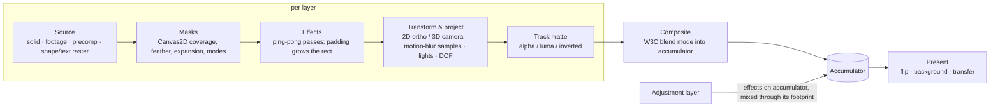

# pooEffects — Architecture

This document explains how pooEffects turns a project document into pixels:
- the thread model;
- the document and history;
- time and keyframe evaluation;
- the matrix pipeline;
- the per-frame lifecycle and shader pass graph;
- the worker protocol;
- the RAM cache and playback;
- export;
- the UI architecture;
- the computer-vision & tracking subsystem (§14).

File references are relative to `src/`.

---

## 1. Thread model

```
 ┌──────────────────────────── UI thread ────────────────────────────┐        ┌──────────── render worker ────────────┐
 │ React UI (ui/*)                                                   │        │ RenderServer (render/server.ts)       │
 │   ├─ zustand app store (state/store.ts): document, selection, UI  │ post   │   ├─ job queue: view > cache > thumb  │
 │   ├─ time store (state/time.ts): current time, playing            │ ─────► │   ├─ Renderer (render/renderer.ts)    │
 │   └─ actions (state/actions.ts): every edit as an immer recipe    │        │   │    WebGL2 on OffscreenCanvas      │
 │ RenderHost (render/host.ts) ── messages / transfers ──────────────┼──────► │   ├─ WorkerAssets (render/assets.ts)  │
 │ RAM cache (state/cache.ts) ◄── ImageBitmap frames ────────────────┼─────── │   │    images, WebCodecs video, audio │
 │ Playback (state/playback.ts) + Web Audio (audio/engine.ts)        │        │   └─ Exporter (export/exporter.ts)    │
 │ Media store (state/media.ts): imports, IndexedDB, <video> fallback│ ◄───── │        mediabunny · gifenc · fflate   │
 └───────────────────────────────────────────────────────────────────┘        └───────────────────────────────────────┘
```

**Rendering, decoding and encoding all live in one module worker.** The UI thread never touches WebGL. It sends the
project (structured-cloned on every committed change) and render requests, and receives `ImageBitmap`s with zero-copy
transfer.

**Fallback.** If a worker cannot create a WebGL2 context on an `OffscreenCanvas`, the host transparently falls back to
an **inline server**. That is the same `RenderServer` class, loaded with a dynamic `import()` and run on the main thread.
Messages posted while it loads are queued and replayed.

**Video.** Video frames are decoded in the worker with WebCodecs, through mediabunny's `VideoSampleSink`. When the
worker can't decode a container, it sends a `needVideoFrame` request. The UI thread answers with a frame grabbed from a
seeked `<video>` element.

---

## 2. Document model, history and change detection

- **Immutable project.** The `Project` (`core/types.ts`) is a plain JSON tree:
  - compositions, each with an ordered layer list (index 0 = top), work area, motion-blur settings and markers;
  - footage, folders and settings.
- **Animated properties.** Every animatable value is an `AnimProp<V> = { value, keyframes[], expression?, expressionEnabled? }`.
- **Property paths.** Properties are addressed by dot paths such as `transform.position` or `effects.fx12.params.radius`.
  Array segments resolve by element `id`, so paths stay stable when items are reordered (`core/props.ts`).
- **Edits.** Every edit is an immer recipe run through `doc()` in `state/store.ts`. The previous document goes onto the
  undo stack.
- **Transactions.** Continuous gestures (drags, scrubs, colour pickers) call `beginTx()` and `endTx()`, so the whole
  gesture is **one** undo step. `cancelTx()` (Esc) restores the base document.
- **Coalescing.** Rapid discrete edits with the same `coalesce` key within 900 ms merge into one undo step.
- **Structural sharing.** Unchanged sub-trees keep their object identity, which makes change detection cheap
  everywhere:
  - the RAM cache compares references (§7);
  - the worker re-syncs on reference change;
  - React selectors re-render only what changed.
- **High-frequency time lives outside the document.** Current time and the playing flag are in a separate vanilla store
  (`state/time.ts`), so 60 fps playback only re-renders the handful of components that display time.

---

## 3. Time

- **Seconds everywhere.** Times are `number` seconds.
- **Layer time.** Keyframes are stored in *layer time*: `layerTime = (compTime − startTime) / (stretch / 100)`. Moving
  or stretching a layer therefore never rewrites its keyframes.
- **Exact frame rates.** NTSC rates map to exact rationals in `core/time.ts`: 23.976 → 24000/1001, 29.97 → 30000/1001,
  59.94 → 60000/1001.
  - `timeToFrame(t) = floor(t · fps + 1e-4)`.
  - `snapToFrame` rounds to the nearest frame.
- **SMPTE drop-frame timecode** works at 29.97, 59.94 and 119.88. It skips frame numbers 0–1 (0–3 at 59.94) at the
  start of every minute, except every tenth minute. `frameToTimecode` and `timecodeToFrame` are exact inverses (tested).

---

## 4. Keyframe evaluation (`anim/interpolate.ts`)

### 4.1 Temporal interpolation

Each keyframe has, per dimension, an incoming and outgoing ease `{ speed, influence }` and an interpolation type
(linear, Bézier, continuous, auto, hold). A segment `k0 → k1` with `Δt = t1 − t0` is a **cubic Bézier in (time, value)**:

```
P0 = (t0,                  v0)
P1 = (t0 + infOut·Δt,      v0 + speedOut·infOut·Δt)
P2 = (t1 − infIn·Δt,       v1 − speedIn·infIn·Δt)
P3 = (t1,                  v1)
```

- **Derivative at the keyframes.** The derivative at each end equals the specified speed, which is the After Effects
  model.
- **Evaluation.** For a query time `t`, the evaluator solves `x(s) = t` for the curve parameter `s` with Newton's method
  plus bisection, then returns `y(s)`.
- **Linear sides** use the chord slope as their speed, with influence ⅙. A linear–linear segment is exactly linear.
- **Auto-Bézier** speeds come from the neighbours: the slope between the previous and next keyframes, or flat (speed 0)
  when the keyframe is a local extremum. Easy Ease is speed 0 at influence ⅓.
- **Hold** keeps `v0` until `t1`.
- **Continuous** forces equal in and out speeds.
- **Multi-dimensional properties** (scale, colour, …) are interpolated per dimension with their own eases.

### 4.2 Spatial interpolation

**Position-like** properties use one ease and travel along a spatial path:

1. **Path segment.** Between `k0` and `k1` the path is an N-D cubic Bézier:
   `p0`, `p0 + to0`, `p1 + ti1`, `p1`. The tangents come from `to` and `ti`, or from **auto-Bézier** tangents derived
   from the neighbouring keyframes (Catmull-Rom style, scaled by ⅓ of the neighbour distances).
2. **Arc-length table.** An arc-length lookup table with 64 samples maps distance to the Bézier parameter.
3. **Distance easing.** The temporal ease runs on a *scalar*: distance along the path, `0 → L`. The neighbour segments'
   lengths are mapped into the same space so that auto speeds are continuous across keyframes. The result is a single
   speed graph in px/s, as in AE.
4. **Point lookup.** Distance → parameter through the table → point on the curve.

### 4.3 Special value types

- **Bézier paths** (masks, shape paths) interpolate vertex by vertex, including tangents. When the two keyframes have
  different vertex counts, the value holds instead.
- **Gradients** interpolate stop by stop. When the stop counts differ, the value holds.
- **Strings, booleans and choices** hold.

### 4.4 Expressions (`anim/expressions.ts`)

- **Semantics.** Expressions are JavaScript with AE semantics: the value of the *last statement* is the result, and
  undeclared assignments stay local.
- **Compilation.** Each source is compiled once, cached, and tried in this order:
  1. `return (src)`;
  2. `return` inserted before the last top-level statement;
  3. `eval(src)` for exact completion-value semantics.
- **Scope.** Code runs inside `with (scopeProxy)`. The scope exposes:
  - the property: `time`, `value`, `thisProperty`, `velocity`, `speed`, `key()`, `numKeys`, `nearestKey()`;
  - the layer and comp: `thisLayer` (transform, effects, `toComp` / `fromComp`, …) and `thisComp.layer(name|index)`;
  - the helper vocabulary: `wiggle`, `loopIn` / `loopOut`, `linear` / `ease`, `random` / `seedRandom`, vector maths and
    colour conversion.
- **Evaluation order.** `FrameEval` evaluates the keyframed value first and passes it as `value`.
- **Other times and recursion.** Expressions that sample other properties or other times (`valueAtTime`, `wiggle`) get a
  child evaluator one depth level deeper. This bounds self-reference.
- **Errors** are collected per `(layer, path)` and shown in the timeline.

---

## 5. Matrix math

### 5.1 Coordinate system

- **Axes.** Comp space has +X to the right, +Y **down** and +Z **into the screen**, with the origin at the comp's
  top-left. This matches AE.
- **Matrices** are column-major `Float64Array(16)` used with column vectors (`math/mat4.ts`). They are converted to
  `Float32Array` only at upload.

### 5.2 Layer transforms (`core/evaluate.ts`)

```
M_local = T(position) · Rx(orient.x) · Ry(orient.y) · Rz(orient.z) · Rx(rotX) · Ry(rotY) · Rz(rotZ) · S(scale/100) · T(−anchor)
M_world = M_world(parent) · M_local
```

- **2D layers** use the same matrix with orientation and X/Y rotation ignored and z forced to 0.
- **Parenting** composes world matrices recursively. Opacity is *not* inherited, as in AE.
- **`setParent` compensates:** it re-expresses the child's position, rotation and scale in the new parent's space, so
  the layer doesn't jump.
- **Memoisation.** `FrameEval` caches every resolved property, local matrix and world matrix for its `(comp, time)`
  pair. A frame evaluates each transform once.

### 5.3 Cameras and projection

- **Camera matrix.** A two-node camera looks from `position` at the point of interest:

  ```
  C    = T(position) · R_lookAt(position → POI) · R(orientation) · Rx(rotX) · Ry(rotY) · Rz(rotZ)
  View = C⁻¹
  ```

  A one-node camera omits `R_lookAt`.
- **Zoom.** AE describes the camera by *zoom*: the distance in pixels at which one world unit maps to one pixel. With
  comp size `w × h`:

  ```
  perspectiveAE(w, h, zoom, near, far):
     [ 2·zoom/w   0          0                    0                 ]
     [ 0          2·zoom/h   0                    0                 ]
     [ 0          0          (f+n)/(f−n)          −2·f·n/(f−n)      ]
     [ 0          0          1                    0                 ]
  ```

  The projection is placed after `View`, which re-centres the comp so the camera axis passes through `(w/2, h/2)`.
- **Default camera.** A 3D layer at z = 0 seen through the default camera, at position `(w/2, h/2, −zoom)` and zoom
  `= focal/36 · w`, appears at exactly its 2D size.
- **Clip to pixels.** NDC are mapped to texture pixels at the render scale. Row 0 is the *top* of every texture, and only
  the final present pass flips for the canvas.
- **Orthographic views.** Front, back, left, right, top and bottom use `orthoCentered` with fixed axis bases. The custom
  view orbits a centre with yaw, pitch and distance (`render/projection.ts`).
- **Shared projection code.** The viewer overlay (`ui/viewer/geometry.ts`) uses the same projection to draw gizmos,
  motion paths and hit tests, and to unproject rays onto layer planes for 3D dragging.

### 5.4 Render scale

`RenderOptions.scale` multiplies every texture size; layout stays in comp units.

- **Layer sources** (solids, rasters, precomps) rasterise at their **screen scale**. For 3D layers that is the projected
  size of 100 layer units at the anchor point.
- **Quantisation.** Screen scale is quantised to ⅛-octave steps, so animation doesn't trigger re-rasterisation every
  frame.

---

## 6. Frame lifecycle

What happens when the current time changes:

1. **Time changes.** The time store updates, through scrubbing, a key press or playback.
2. **Viewer request.** Each viewer pane (`ui/viewer/ViewPane.tsx`) schedules one `requestAnimationFrame` render request.
3. **Cache check.** `renderForView` (`state/engine.ts`) quantises time to a frame. It returns a RAM-cache hit
   immediately, or sends `render {key: 'view:<comp>:<pane>', purpose: 'view'}` to the worker.
4. **Coalescing.** The worker's queue drops any older queued request with the same view key, answering it with
   `cancelled`. Views always run before cache and thumbnail jobs. The pump yields to the event loop between jobs.
5. **Render.** `Renderer.render(opts)` creates a `FrameEval(project, comp, t)` and calls `renderComp()` (§6.1).
6. **Present.** The result is presented to the worker's `OffscreenCanvas`: flipped, over the optional background colour.
   The worker then calls `transferToImageBitmap()` and posts a `frame` message. The bitmap is transferred, not copied.
7. **Cache store.** The host resolves the request, stores the bitmap in the RAM cache (§7), and the pane paints it onto
   its 2D canvas at the current zoom and pan. Gizmos are drawn on a second overlay canvas, which repaints without
   re-rendering.

### 6.1 Shader pass graph (`render/renderer.ts`)



**Layer order.** Layers are visited **bottom → top**. Each step works on pooled render targets (`render/gl/gl.ts`):
FBO-backed textures keyed by size and format, reset every frame and evicted when idle.

- **Source.**
  - Solids are cleared textures.
  - Images upload once. Video frames upload per frame.
  - **Precomps render recursively** at the needed scale with `renderComp()`. Results are memoised per frame by
    `(comp, time, scale)`, so a precomp used twice renders once.
  - **Shapes and text** are evaluated to draw ops and rasterised with Canvas2D on an `OffscreenCanvas`. The rasters
    upload and are cached per layer under a hash of the evaluated geometry and paint, so static or held content never
    re-rasterises.
- **Masks.** Mask paths are evaluated, combined with their modes in a Canvas2D coverage canvas, feathered with a
  Gaussian blur, and multiplied in (`FS_MASK_APPLY`).
- **Effects.** Each effect is an `EffectImpl` (`render/effects/impls.ts`) that takes an input texture plus an `FxCtx`:
  layer-space rect, texture scale, evaluated parameters, time, audio access and a canvas provider. It returns a new
  texture. Effects that spill outside the layer (glow, drop shadow, displacement, light rays) declare `pad()`; the
  pipeline grows the image rect first, so later passes and the projection see the larger footprint. Shared helpers in
  `effects/kit.ts`:
  - a **Gaussian blur pyramid** that downsamples until σ ≤ 10, blurs separably, then upsamples;
  - LUT textures for curves and gradients;
  - a full-screen pass runner.
- **Transform and project** (`FS_LAYER` / `VS_LAYER`). The layer quad (its rect in layer units) is transformed by
  `M_world` and the view-projection.
  - **Motion blur.** When enabled, the quad is drawn `N` times at sub-frame times across the shutter. The shutter spans
    `angle/360` of a frame, starting at `phase/360`, and each sample has its own `FrameEval`. Samples accumulate
    additively with weight `1/N` into an `rgba16f` target.
  - **Lighting** (3D layers that accept lights) is evaluated per pixel in straight colour: ambient + Σ diffuse·N·L +
    Phong specular. It supports point, spot and parallel lights, cone angle, feather and falloff, and the material's
    metal tint.
  - **Depth of field.** The layer is pre-blurred once at the maximum circle of confusion over its corners. The shader
    mixes sharp and blurred by the per-pixel CoC: `|z − focus| / z · aperture · blurLevel · scale`.
- **3D runs.** Consecutive 3D layers form a run sorted far → near by view-space depth. The run shares a depth renderbuffer
  per nesting level, so intersecting layers occlude correctly. Each layer is drawn with `LEQUAL` (coplanar layers stack
  in layer order). A depth-only pass then writes depth where alpha ≥ 0.5.
- **Track matte.** The matte layer is projected through the same pipeline and applied by alpha or luma, optionally
  inverted (`FS_MATTE`).
- **Composite.** `FS_COMPOSITE` implements the W3C separable and non-separable blend modes on premultiplied colour, plus
  dissolve, stencil, silhouette, alpha add, luminescent premultiplied and Preserve Underlying Transparency. It
  ping-pongs between two accumulators.
- **Adjustment layers.** These copy the accumulator, run their effect stack on it, then mix the result back through
  their own projected, masked footprint (`FS_MIX`).
- **Precision.** Everything is premultiplied alpha. The accumulator is `rgba8`, or `rgba16f` for 16/32-bpc comps.

---

## 7. RAM cache & playback

### 7.1 Frame cache (`state/cache.ts`)

- **Keys and budget.** Frames are keyed by `comp | frame | config`, where config is render scale, motion blur and draft.
  They are stored as `ImageBitmap`s under a memory budget (Preferences, default 1.5 GB) and evicted least-recently-used.
- **Dependency-based invalidation.** After each document change, every cached comp's **signature** is recomputed: the
  object references of the comp, its nested precomps (recursively) and the footage it uses. Structural sharing makes
  this exact: if all references match, every cached frame is still valid. Editing a precomp invalidates every comp that
  nests it, and nothing else.
- **Ruler display.** The timeline ruler draws cached runs as the green bar.

### 7.2 Background rendering (`state/engine.ts`)

While idle, the engine fills the work area of the active comp in the background, starting from the current time and
wrapping around:
- at most two `cache` jobs are in flight;
- rendering stops when the cache is full, during playback, and during transactions;
- any edit bumps a generation counter, cancelling stale jobs.

### 7.3 Playback (`state/playback.ts`)

- **Real-time.** If every frame of the work area is cached, playback runs in real time.
  - With audio, the clock is the `AudioContext`: the comp's audio graph is scheduled with sample-accurate start times,
    and the displayed frame is derived from `audioContext.currentTime`. Audio and video stay locked even when the UI
    hitches.
  - Without audio, the clock is `performance.now()`.
- **Render-as-you-go.** Otherwise the controller keeps a few frames ahead in flight, caches them as they arrive, and
  advances no faster than the comp frame rate. The green bar fills in, and on the next loop playback switches to real
  time automatically.

---

## 8. Worker protocol (`render/protocol.ts`)

| UI → worker | Purpose |
| --- | --- |
| `init {fonts}` | Create the WebGL2 renderer and load bundled fonts into the worker's `FontFaceSet`; replies `ready {caps}` or `fatal`. |
| `project {project}` | Replace the document (sent on every committed change). |
| `image / video / audio / font` | Register assets. Bitmaps and audio buffers are transferred; video arrives as a `Blob` and is demuxed lazily. |
| `render {id, key, purpose, opts, bg, maxSize?}` | Queue a frame. `purpose` ∈ `view` (coalesced per key) · `cache` · `thumb`. |
| `cancel {purpose}` | Drop queued jobs of that purpose (answered with `cancelled {ids}`). |
| `export {job}` / `cancelExport` | Start or cancel an export job (§9). |
| `videoFrameReply {reqId, bitmap}` | Answer to a `needVideoFrame` fallback request. |

| Worker → UI | Purpose |
| --- | --- |
| `frame {id, bitmap, ms, layers, errors}` | Rendered frame (bitmap transferred) with timing stats and expression errors. |
| `renderError` / `cancelled` | A job failed or was superseded; the host resolves the request with `null`. |
| `needVideoFrame {footageId, time}` | Ask the UI thread for a `<video>`-decoded frame (4 s timeout). |
| `exportProgress {frame, total, preview, fps}` / `exportDone {blob}` / `exportError` | Export lifecycle. |
| `log` | Diagnostics. |

**Requests and replies.** `RenderHost.render()` returns a promise per request. Superseded or failed requests resolve
with `null`, never reject, so callers simply skip a frame.

---

## 9. Export (`export/exporter.ts`, `state/renderQueue.ts`)

- **Where it runs.** Export runs in the worker against the same `Renderer`, at full quality: motion blur and DOF on, no
  draft, no guides. Viewer renders keep working at a reduced rate.
- **Audio.** Before an MP4 or WebM job starts, the UI thread renders the comp's audio with an `OfflineAudioContext` at
  48 kHz, using the same graph as playback, and transfers the PCM with the job.
- **Video encoding.** MP4 and WebM go through mediabunny `Output` with `VideoSampleSource` and `AudioSampleSource`.
  - The first encodable codec wins: H.264 → HEVC → AV1 → VP9 for MP4, and VP9 → VP8 → AV1 for WebM.
  - Each rendered frame becomes a `VideoSample` straight from the WebGL canvas. `await source.add()` gives encoder
    backpressure, so memory stays flat for long renders.
  - WebM-alpha keeps the alpha channel (`alpha: 'keep'`).
- **GIF.** Each frame is read back, unpremultiplied and quantised to its own 256-colour palette (`gifenc`, with
  `rgba4444` and 1-bit transparency when alpha is present), then written with the frame delay.
- **PNG sequence.** Frames are encoded with `OffscreenCanvas.convertToBlob('image/png')`, keeping alpha, and zipped with
  `fflate`.
- **Render Queue.** Jobs run one after another. Progress, a thumbnail every 8 frames, fps and ETA stream back to the
  panel. Finished files are offered as blob URLs, with optional auto-download.

---

## 10. Shapes & text

- **Shape evaluation** (`shapes/evaluate.ts`) follows AE semantics. Items in a group are processed top → bottom:
  - **generators** push path entries;
  - **operators** rewrite every entry above them *in place*, including entries of nested groups. Trim, Zig Zag, Round
    Corners, Offset, Pucker & Bloat, Twist and Wiggle are operators;
  - **renderers** (fill, stroke, gradients) capture the entries above them;
  - **Merge Paths** collapses the stack into one compound entry;
  - **Repeater** clones everything above it with cumulative transforms.

  Group transforms bake into the geometry, and the result is a list of draw ops in layer space. The operators are in
  `shapes/modifiers.ts`; trim measures arc length with uniform parameters on linear segments.
- **Text.**
  - **Layout** (`text/layout.ts`): point and box text, tracking, leading, justification, caps and baseline shift.
  - **Animators** (`text/animate.ts`): range and wiggly selectors are evaluated per character, word or line, and
    combined with their modes. The result drives each glyph's transform, colour, opacity and blur.
  - **Rasterisation** (`text/rasterize.ts`): per glyph with Canvas2D; fonts load inside the worker.

---

## 11. UI architecture

- **Panels and docking.** Panels are registered in `ui/panels/registry.tsx`. The dock (`ui/dock`) is a pure tree of
  splits and tab groups (`DockNode`), manipulated by small functions: insert at a drop zone, move, remove and normalise.
  Workspaces are tree factories.
- **Commands.** Menus, context menus, toolbars and the keymap all call the same command registry (`ui/commands.ts`) and
  action layer (`state/actions.ts`).
- **Keymap.** The keymap (`ui/shell/keymap.ts`) is a table. The handler matches combos against it and the Keyboard
  Shortcuts dialog renders it, so the documentation can't drift from behaviour. <kbd>Space</kbd> plays on release unless
  the viewer was dragged while it was held, which makes it AE's temporary hand tool.
- **Rendering cost.** Heavy panels subscribe to time through `useThrottledTime` (≈10–12 Hz while playing, exact while
  paused). The timeline virtualises rows. The viewer draws bitmaps and overlays on canvases.

---

## 12. Persistence

- **Auto-save.** The project auto-saves to IndexedDB 1.5 s after the last change. Media blobs are stored on import, so
  reloading restores the session and its footage.
- **`.pooe` files** are ZIP archives of `project.json` plus `media/<footageId>` blobs and `mattes/<matteId>/<rev>`
  roto matte revisions (deflated 8-bit alpha).
- **Roto mattes** live outside the document in an immutable revision store (`state/mattes.ts`), mirrored to IndexedDB and
  to the render worker. The document maps frame → revision, so undo/redo restores earlier mattes exactly.
- **Procedural footage.** The demo soundtrack is marked `procedural`. It is regenerated deterministically on load instead
  of being stored (`demo/music.ts`, synthesised with an `OfflineAudioContext` and encoded as 16-bit WAV).

---

## 13. Tests

`npm test` runs 45 node:test cases with tsx:

- **Interpolation** (`tests/interpolate.test.ts`):
  - linear, hold and easy-ease segments, and clamping outside the keyed range;
  - speed at a Bézier keyframe equals its ease speed;
  - per-dimension easing;
  - constant-speed straight spatial paths, and curved paths that pass through their keyframes;
  - auto-Bézier flat at extrema;
  - vertex-wise path interpolation.
- **Timecode** (`tests/time.test.ts`):
  - exact NTSC rationals;
  - non-drop and drop-frame timecode, with round trips;
  - stable frame/time conversion at frame boundaries;
  - time-input parsing.
- **Expressions** (`tests/expressions.test.ts`):
  - completion-value semantics, including `if/else` as the last statement;
  - undeclared locals;
  - deterministic, bounded `wiggle`;
  - `loopOut('cycle')`;
  - scalar broadcast and error fallback;
  - unreachable globals;
  - `linear` and `ease`.
- **Shapes** (`tests/shapes.test.ts`):
  - rectangle perimeter and AE start vertex, and ellipse circumference;
  - Trim Paths length, offset wrap-around, and trimming a stroke placed above it;
  - Repeater cloning fills and strokes;
  - group transforms baking into geometry and scaling stroke width.
- **Computer vision** (`tests/cv-*.test.ts`, synthetic imagery from `tests/cvsynth.ts`):
  - SVD / symmetric eigen / Cholesky accuracy, Rodrigues and AE Euler round trips (with continuity);
  - FAST and Shi–Tomasi detection with minimum-distance spacing;
  - pyramidal KLT on a 28 px sub-pixel shift (< 0.08 px error) and the NCC feature tracker under a gain change;
  - homography RANSAC with 30 % outliers; essential-matrix pose recovery; PnP RANSAC with 20 % outliers;
  - full camera solves: free move with **unknown focal length** (focal within 6 %, trajectory error < 6 %) and an
    auto-detected tripod pan;
  - planar tracker corners within 0.25 px after nine perspective frames; adaptive point tracking;
  - marching-squares contours, resampling, distance transform and component filtering.

---

## 14. Computer vision & tracking

Everything runs client-side. File references are relative to `src/`.

### 14.1 Threads and the analysis frame channel

```
 UI thread                         render worker                        tracking worker (cv/worker.ts)
 ──────────                        ─────────────                        ───────────────────────────────
 state/tracking.ts ── job ───────────────────────────────────────────►  PointTracker · PlanarTracker · SfM
 state/roto.ts     ── job ──────────────────────┐                        ▲  │ frame requests
                                                │                        │  ▼
 cv/host.ts: new MessageChannel() ─ port1 ─►  RenderServer  ◄──── port2 ─┘  (AnalysisRequest / Reply)
                                   renders the layer's source through a synthetic single-layer comp,
                                   readPixels → RGBA8 ArrayBuffer (transferred, never via the UI thread)
                                                                         SAM 2 worker (cv/sam/worker.ts)
                                                                         onnxruntime-web: WebGPU → WASM
```

- **Synthetic analysis comps** (`cv/host.ts → analysisComp`). A clone of the tracked layer with identity transform and
  no masks, effects or matte, inside a comp the size of the layer source. Its timing (start, stretch, time remap) is kept,
  so comp times map 1:1. This is what After Effects' Layer panel shows the tracker.
- **Scheduling.** Analysis requests join the render server's queue with priority `view (0) < analysis (0.5) < cache (1) <
  thumb (2)`, so the viewer stays responsive while a track runs.
- **Read-ahead.** `cv/frames.ts` requests frame *i + 1* while frame *i* is processed. It keeps grayscale Gaussian pyramids
  (with Scharr gradients) for the last few frames.

### 14.2 Point tracker (Track Motion / Stabilize)

`cv/klt.ts`, `cv/pointTracker.ts`. Each track point has a **feature region** (the template) inside a **search region**.
1. **Coarse search.** Exhaustive normalised cross-correlation at the pyramid level where the template is about 6–16 px.
   Window statistics come from integral images, so each candidate costs one dot product.
2. **Refinement.** ±2 px NCC refinement on each finer level.
3. **Sub-pixel Lucas–Kanade.** Inverse-compositional, translation-only alignment at level 0 with gain/bias normalisation
   (robust to exposure changes).
4. **Confidence** = final NCC × 100. Below the threshold the tracker continues, stops, extrapolates the previous velocity,
   or re-grabs the template ("adapt"). "Adapt feature on every frame" refreshes the template every frame.

Results stream back per frame and are written as linear keyframes on `trackers[].points[].featureCenter / attachPoint /
confidence`. They show up in the timeline under *Motion Trackers*. A whole run is one undo step (`beginTx`/`endTx`).

**Applying** (`state/tracking.ts`):
- *Transform* writes the attach point, mapped tracked-layer → comp (→ target parent), into the target's position.
  Two-point tracks add rotation (unwrapped angle delta) and scale (distance ratio).
- *Stabilize* writes the attach point into the layer's own **anchor point** and pins position at the first frame's comp
  location. Rotation and scale are inverted.
- *Edit Target* chooses the layer (or a new Null) and X/Y dimensions.

### 14.3 Planar tracker (perspective corner pin)

`cv/planar.ts`, `cv/homography.ts`.
- Shi–Tomasi features inside the quad are tracked frame to frame with forward–backward-checked KLT.
- Every feature remembers its **reference-frame** position, so the homography is always estimated **reference → current**
  (Hartley-normalised DLT inside MSAC RANSAC, then Gauss–Newton on the 8 parameters). Matrices are never chained.
- **Drift removal.** Each inlier is re-aligned against the reference image resampled through H⁻¹, giving an exact
  projective template. H is then re-estimated from the aligned points. On synthetic perspective motion the corners stay
  within 0.25 px after nine frames.
- Lost features are replenished inside the current quad and back-projected via H⁻¹.
- *Apply* keyframes the target's **Corner Pin** effect with the four corners mapped into target-layer space.

### 14.4 3D camera tracker

`cv/features.ts`, `cv/geometry3d.ts`, `cv/bundle.ts`, `cv/sfm.ts`.
1. **2D tracks.** FAST-9 candidates are re-scored by the Shi–Tomasi response and spaced on a grid. Tracking uses KLT
   with a forward–backward check plus an 8-point **fundamental-matrix RANSAC** that rejects features sliding along edges
   or riding moving objects. Features are replenished below 70 %.
2. **Keyframes** are chosen by median displacement (≈3 % of width) and track survival.
3. **Angle of view.**
   - Sweep: each candidate focal (22°–98° horizontal) gets a quick reconstruction scored by reprojection error ÷ coverage.
   - Golden-section polish around the best candidate.
   - Final bundle adjustment with **focal as a free parameter**.
   - Skipped when the user specifies the angle of view.
4. **Initial pair.** The pair with the most parallax where an essential matrix (8-point on normalised coordinates,
   Sampson-distance RANSAC) clearly beats a homography. Decompose E → (R, t), choose by cheirality, triangulate (DLT).
5. **Incremental registration.**
   - Each keyframe gets **PnP**: 6-point DLT in RANSAC, compared with a robust refinement seeded from the nearest
     registered pose; the better one wins.
   - New points are triangulated when their parallax exceeds 1° and every view reprojects within 3 px.
6. **Bundle adjustment.** Levenberg–Marquardt with **Schur complement** elimination of the 3×3 point blocks, Huber IRLS,
   rotation updates `R ← exp([δω]×)·R`, and an optional shared focal. Outlier observations and points are pruned between
   passes.
7. **All frames.**
   - Non-keyframes are resected against the fixed cloud (motion-only LM), seeded by slerp / centre lerp.
   - A **final bundle adjustment runs over every frame**, strided to at most 240 cameras, so the shot's end frames and
     the focal length see all observations. Skipped frames are then re-resected.
   - Outlier pruning uses a robust threshold, `max(1.25 px, 3 · 1.4826 · median error)`. An RMS-based threshold would be
     inflated by the very outliers it should remove.
8. **Tripod pans** (homography explains everything) are solved as **rotation-only cameras**: 2-point Kabsch RANSAC on
   bearing vectors, then a rotation-only bundle adjustment with points on the unit sphere.

**Measured on the Tracking Demo plate** (real rendered frames, "Low" detail, 720 px analysis):

| Run | Frames | RMS error | Median point error | Points | Horizontal FOV (truth 61.9°) |
| --- | --- | --- | --- | --- | --- |
| 2 s | 60 | 0.26 px | 0.12 px | 259 | 64.8° |
| full 6 s | 180 | 0.36 px | 0.21 px | 260 | 58.1° |

- The 2 s run's yaw change was −6.3° (ground truth ≈ −6.2°).
- Focal length is recovered to about ±6% on this mostly lateral move. On synthetic scenes with 14% drifting tracks it is
  within 0.01%.

**Solver → comp space** (`sceneMap`):
- The first camera becomes AE's default camera at `[w/2, h/2, −zoom]` with identity orientation.
- `zoom = f · sourceScale · layerScale`.
- The scene is scaled so the median track-point depth equals the zoom; track points then sit near *z = 0* at 100 % scale.
- With a ground plane, the plane normal maps to −Y and the origin to the comp centre.
- Camera orientation is `Q · R₀ · R_kᵀ`, decomposed into AE's X→Y→Z order with 360°-continuity.

**Viewer.** Track points are drawn as crosses sized by nearness and coloured by depth. Hovering shows an AE-style target
disc on the plane through the nearest three points. Selecting points (click / shift / marquee) enables *Set Ground Plane*
and *Create Null / Solid / Text / Shadow Catcher and Camera*. Layers are oriented to the fitted plane.

### 14.5 SAM 2 auto-rotoscope

`cv/sam/engine.ts`, `cv/sam/worker.ts`, `state/roto.ts`, `state/mattes.ts`.
- **Model.** `onnx-community/sam2.1-hiera-tiny-ONNX`: vision encoder plus prompt-encoder/mask-decoder.
  - Precision variants: fp16 (default with WebGPU), int8 and fp32.
  - Downloaded once and cached in **Cache Storage**, or loaded from local files.
  - Executed by `onnxruntime-web/webgpu` in a worker. Falls back to the WASM backend; the wasm binary is a Vite asset.
- **Inference.**
  - Frames are resized to 1024² (SAM 2 does not preserve aspect) and ImageNet-normalised.
  - Embeddings for the three most recent frames are cached, so extra clicks on one frame re-run only the decoder.
  - The 256² logits are bilinearly upsampled to the matte raster (long edge ≤ 1024) and passed through a sigmoid, giving a
    soft 8-bit alpha.
- **Prompts.** Click = foreground, Alt/right-click = background. Prompts are stored per frame in the document.
- **Temporal propagation.** This ONNX export has no memory-attention inputs, so the previous result is carried forward as
  prompts instead:
  1. Sparse KLT flow between consecutive frames.
  2. A RANSAC homography over features inside the object warps the previous matte.
  3. The warped matte yields a box prompt and positive points at well-separated distance-transform maxima. Tracked
     background features just outside become negative points.
  4. Of SAM's three hypotheses, the one maximising 0.65·IoU(warped) + 0.35·predicted-IoU wins. A collapsing object score
     or IoU stops the run ("object lost").
  5. Propagation stops at the next frame that carries user prompts, so corrections act as keyframes.
  6. On a synthetic moving object the real model holds IoU ≥ 0.996 over ten propagated frames.
- **Refine edge (GPU).** The *Roto Brush & Refine Edge* effect resamples the matte into the effect rect, then:
  - optional neighbour blend (*Reduce Chatter*);
  - separable max/min morphology (*Shift Edge*);
  - Gaussian *Feather*;
  - sigmoid-like *Contrast*;
  - **Decontaminate Edge Colors**: semi-transparent edge pixels take the blurred colour of nearby core-foreground pixels,
    with weight `amount · (1 − α)`.
- **Freeze.**
  - *Bake to Track Matte* duplicates the layer (keeping only the roto effect) and sets it as the original's alpha matte.
  - *Bake to Mask Path* traces every frame with marching squares, resamples to a perimeter-based vertex count, aligns
    vertex order to the previous frame (no swimming), fits Catmull–Rom Bézier tangents and keyframes one animated mask.

### 14.6 UI

- **Tracker panel** (`ui/panels/TrackerPanel.tsx`) has three modes:
  - Motion: Track Motion, Stabilize or Perspective; position/rotation/scale; Edit Target; ±1 frame and forward/backward
    transport, stop; options; reset and apply.
  - 3D Camera: shot type, angle of view, detail; solve stats; per-frame error chart; scene scale; creation actions.
  - Roto Brush: model status and download, prompts, propagate, refine controls, freeze.
- **Viewer overlay** (`ui/viewer/trackOverlay.ts`):
  - feature/search boxes with resize handles (Alt-drag moves the feature region alone);
  - attach-point crosshair, confidence label and motion path;
  - a 4× magnifier loupe while dragging;
  - the perspective quad with its live feature cloud;
  - camera track points and roto contours with prompt dots.
- **Timeline.** A *Motion Trackers* property group, plus an analysis strip under the ruler:
  - per-frame confidence (green → red);
  - camera solve error;
  - roto frames (pink, user frames brighter);
  - a glowing head while a job runs.
- **Workspace and shortcuts.** A *Motion Tracking* workspace, the Roto Brush tool (<kbd>Alt+W</kbd>), *Animation ▸ Track
  …* menu items and a layer *Tracking* submenu.
